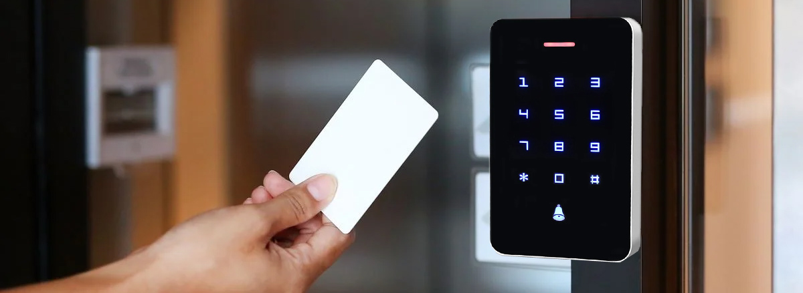
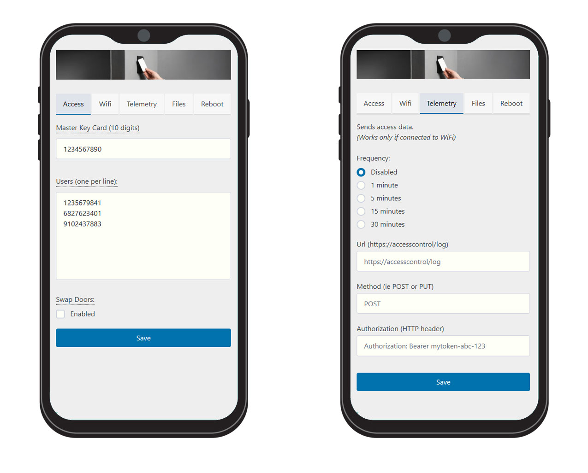

# wiegand access control

2 door authentication project using Wiegand Keypad/Card reader and ESP8266 Wifi-capable microcontroller

## Admin interface

## Schematic Plan

| **GPIO** | **PIN** | **Role**            | **Parts**                            | **Comments**          |
|----------|---------|---------------------|--------------------------------------|-----------------------|
| 16       | D0      | Primary LEX/BUZ UX  | Transitor 2N2222 + 10K resistor      | Door 1 feedback |
| 5        | D1      | Door 1 (In) Opener  | Relay SSR 5V                         |                       |
| 4        | D2      | Door 2 (Out) Opener | Relay SSR 5V                         |                       |
| 0        | D3      | FLASH button        | Momentary Push button + 10k resistor |                       |
| 2        | D4      | LED Onboard         |                                      | Debugging             |
| 14       | D5      | READER1 D0          | 2K + 10K resistor                    | voltage divider       |
| 12       | D6      | READER1 D1          | 2K + 10K resistor                    | voltage divider       |
| 13       | D7      | READER2 D0          | 2K + 10K resistor                    | voltage divider       |
| 15       | D8      | READER2 D1          | 2K + 10K resistor                    | voltage divider       |
| 1        | TX      | Secondary LED/BUZ UX| Transistor 2N2222 + 10K resistor     | Door 2 feedback       |
